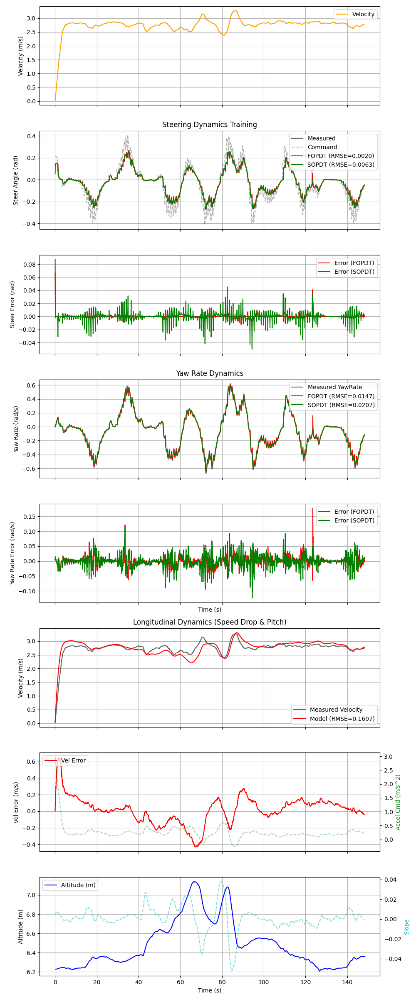

# 【爆速シミュレータ】Unity挙動をPythonで完全再現してみた

## 0. TL;DR
- **What**: End-to-End自動運転の学習用に、AWSIM (Unity) の物理挙動を完全再現するPython製「プロキシ・シミュレータ」を開発した。
- **Result**: ステアリング応答（遅れ・慣性）の誤差を最小限に抑えつつ、実時間比で **100倍以上** の高速化（数万エピソード/時間）を実現した。
- **So What**: これにより、従来のAWSIM環境では不可能だった大規模な強化学習・模倣学習のサイクルを実用的な時間内で回すことが可能になった。

---

## 1. 目的（問題意識・課題感）
- **What**: 自動運転AIチャレンジの攻略において、質の高い学習データを大量に（数万エピソード規模で）収集する必要があった。
- **Why**:
    - 公式のAWSIM (Unity) + ROS2環境はリアルタイム動作を基本としているため、データ収集に膨大な時間がかかる（1時間のデータに1時間の実時間が必要）。
    - ROS2通信のオーバーヘッドやUnityのレンダリング負荷により、並列化（Multiprocessing）によるスケーリングも困難だった。
    - 既存の簡易的なPythonシミュレータでは車両ダイナミクスの再現性が低く、「Sim-to-Sim」転移（Python環境で学習してUnity環境で推論）した際に制御不能になるリスクがあった。
- **Goal**: Unity側の物理挙動（特に操舵応答の遅れ）を高精度に模倣し、かつヘッドレスで超高速に動作する学習専用環境を構築し、MLOpsの基盤とする。

## 2. Approach: Python Proxy Simulator

高精度かつ高速なシミュレーションを実現するため、以下の技術選定を行いました。

### 2.1 Why Python Proxy? (アプローチの選定)
既存の選択肢（AWSIMのTimeScale変更、CARLA/AirSimへの移行）と比較し、「AWSIMの挙動をPythonで再実装する（Proxy Simulator）」というアプローチを採用しました。

具体的には、**「カメラ画像のレンダリングを諦める」「厳密な物理シミュレーションはしない」** というトレードオフを受け入れる代わりに、**「シミュレータと自動運転スタックを単一プロセスで動かす」** ことで並列実行を容易にし、学習に必要な大量のデータを効率よく収集することを最優先しました。
rustやC++で書くことも考えたのですが、速く作れることを優先したいと思ったのでPythonで書いています。

### 2.2 High Performance Architecture (高速化と拡張性の工夫)

- **SingleProcessExecutor & Node Architecture**:
  ROS2のように各機能を「ノード」として分割しつつ、実行時はすべて単一プロセス内で関数呼び出しとして同期実行する`SingleProcessExecutor`を実装しました。これにより、プロセス間通信のオーバーヘッドをゼロにし、決定論的（Deterministic）なシミュレーションを保証しています。また、ユーザーは任意の自作ノード（例：新しいセンサーモデルや制御ロジック）を簡単に追加できます。

  ```python:core/src/core/executor/single_process.py
  # core/src/core/executor/single_process.py
  # ...
  class SingleProcessExecutor:
      def run(self, duration: float, ...):
          # ...
          while self.clock.now < duration:
              for node in self.nodes:
                  # 各ノードに対して、現在の時刻で実行すべきか(周期が来ているか)を確認
                  if node.should_run(self.clock.now):
                      result = node.on_run(self.clock.now) # 直接関数呼び出し (No IPC overhead)
                      node.update_next_time(self.clock.now)
              self.clock.tick()
  ```


- **Parallel Execution with Hydra & Joblib**:
  1回のシミュレーションはシングルスレッドで高速に完結させ、複数エピソードの学習や評価は`hydra-joblib-launcher`を用いてプロセスレベルで並列化しています。PythonのGIL（Global Interpreter Lock）の影響を受けずに、CPUコア数に応じてリニアにスケーリングします。

  ```yaml:experiment/conf/experiment/data_collection.yaml
  # experiment/conf/experiment/data_collection.yaml
  defaults:
    - override /hydra/launcher: joblib # Joblibによる並列実行を指定

  execution:
    total_episodes: 400
    num_jobs: 24 # 24並列で実行
  ```


- **JIT Compilation (Numba)**:
  最も計算負荷の高いLiDARのレイキャスト処理や当たり判定には `Numba` のJITコンパイルを適用しています。これにより、Pythonの柔軟性を保ちつつ、クリティカルパスの処理速度をC++並みに高速化しています。
  speedscopeでプロファイルしてみたところ、200倍ぐらい早くなった

  ```python:simulator/src/simulator/sensor.py
  # simulator/src/simulator/sensor.py
  from numba import jit

  @jit(nopython=True, cache=True)
  def _numba_intersection_kernel(
      sensor_pos: np.ndarray,
      ray_dirs: np.ndarray,
      segments: np.ndarray,
      # ...
  ) -> np.ndarray:
      """JIT-compiled kernel for ray-segment intersection."""
      n_rays = ray_dirs.shape[0]
      # ... (高速なループ処理)
      for i in range(n_rays):
          # ...
          for j in range(m_segments):
              # Ray-Segment交差判定
              # ...
      return ranges
  ```


### 2.3 Node Class Architecture
すべてのシミュレーションコンポーネント（車両モデル、センサー、制御など）は `Node` クラスを継承して実装されています。ユーザーは独自のノードを定義し、設定ファイルに追加するだけで簡単に機能を拡張できます。

```python:core/src/core/interfaces/node.py
# core/src/core/interfaces/node.py
class Node[T: ComponentConfig](ABC):
    """Base class for schedulable nodes."""

    def __init__(self, name: str, rate_hz: float, config: T, priority: int):
        # ...
        self.period = 1.0 / rate_hz

    @abstractmethod
    def on_run(self, current_time: float) -> NodeExecutionResult:
        """Execute node logic."""
        raise NotImplementedError

    def publish(self, topic_name: str, data: Any) -> None:
        """Publish data to a topic."""
        # ...

    def subscribe(self, topic_name: str, default: Any = None) -> Any | None:
        """Subscribe to a topic."""
        # ...
```

### 2.4 System Identification & Longitudinal Dynamics
単なるキネマティックモデル（幾何学的なモデル）では、実車（Unity上のEgo Vehicle）特有の「もっさり感」や「応答遅れ」を再現できません。そこで、実車の応答データを用いたシステム同定を行い、これらの**Simギャップ（シミュレータと実車の乖離）**を最小限に抑えるパラメータ調整を行いました。

また、縦方向（速度）についても空気抵抗やコーナリングドラッグ（旋回時の減速）を考慮することで、カーブでの自然な減速挙動を再現しています。これらをGymライクなインターフェースでラップし、ヘッドレス動作させることで高速化を実現しました。

具体的にどのようなモデル（FOPDTやSOPDT）を採用したかについては、後述の「具体的な検証手順」にて解説します。


## 3. 前提環境 (Prerequisites)
- **OS**: Ubuntu 24.04 (Linux)
- **Runtime**: Python 3.10
- **Package Manager**: `uv` (高速な依存関係解決のためPoetryの代わりに採用)
- **Hardware**: Intel Core i9-13900K (GPU不要。CPUのみで高速並列動作が可能)

## 4. 具体的な検証手順 (Concrete Steps)

再現性を担保するため、以下の手順でシステム同定とベンチマークを実施しました。

### Step 1: 依存関係のセットアップ
`uv` を使用してプロジェクトの依存関係を解決・インストールします。

```bash
uv sync
```

### Step 2: システム同定 (System Identification)
Unity環境で実際に走行して取得したログデータ（MCAP形式）を入力とし、Pythonシミュレータのダイナミクスパラメータ（$\tau, L$）を自動調整します。
Unityから出力される `/features/status/steering_status` (実測ステアリング角) に加え、**`/localization/kinematic_state` (実測ヨーレート)** を用いてダイナミクスパラメータ（$\tau, L$）を調整します。
特に「指令値」対「ヨーレート」の応答遅れに着目することで、車両全体の反応速度（Dynamics）を正確に同定します。

```bash
# args: input_mcap, config_yaml
uv run scripts/system_identification/estimate_dynamics.py train \
    data/system_id/unity_log.mcap \
    experiment/conf/vehicle/default.yaml > docs/blog_vol1_simulator/system_id_result.txt
```

**仕組み (Mechanism)**:
スクリプト内部では `scipy.optimize.minimize (L-BFGS-B)` を使用し、**予測軌道と実測軌道のRMSE（二乗平均平方根誤差）** が最小になるようなパラメータを探索しています。

#### 1. Lateral Dynamics (横方向応答)
ステアリング指令 ($\delta_{cmd}$) から、実際の車両の回頭運動（ヨーレート $\dot{\psi}$）が生じるまでの応答を同定します。
測定ノイズの大きいステアリング角センサ値ではなく、**車両挙動そのもの（ヨーレート）** にフィッティングさせるため、指令値から「実効舵角 ($\delta_{eff}$)」までの応答を1次遅れの**微分方程式（伝達関数の時間領域表現）**としてモデル化しました。

$$ \dot{\psi}(t) = \frac{v(t)}{L_{wb}} \cdot \delta_{eff}(t) $$

- $\dot{\psi}(t)$: ヨーレート (Yaw Rate) [rad/s]
- $v(t)$: 車両速度 (Velocity) [m/s]
- $L_{wb}$: ホイールベース (Wheelbase) [m]
- $\delta_{eff}(t)$: 実効舵角 (Effective Steering Angle) [rad]

ここで実効舵角 $\delta_{eff}$ は、指令値に対して以下のダイナミクスを持ちます。

- **FOPDT (First Order Plus Dead Time)**:
  1次遅れ系に無駄時間を加えたモデルです。シンプルながら車両の遅れ特性をよく表現します。
  $$ \tau \dot{\delta}_{eff}(t) + \delta_{eff}(t) = K \cdot \delta_{cmd}(t - L) $$
  - $K$: ゲイン (Gain) [-]
  - $\tau$: 時定数 (Time Constant) [s]
  - $L$: 無駄時間 (Dead Time) [s]

- **SOPDT (Second Order Plus Dead Time)**:
  振動成分まで考慮した2次遅れモデルです。
  $$ \ddot{\delta}_{eff}(t) + 2\zeta\omega_n \dot{\delta}_{eff}(t) + \omega_n^2 \delta_{eff}(t) = K\omega_n^2 \delta_{cmd}(t - L) $$
  - $\zeta$: 減衰係数 (Damping Ratio) [-]
  - $\omega_n$: 固有角周波数 (Natural Frequency) [rad/s]

本プロジェクトでは比較の結果、**FOPDTモデルの方がRMSE（実測ヨーレートとの誤差）が低かったため、FOPDTを採用しました。**

#### 2. Longitudinal Dynamics (縦方向応答)
アクセル/ブレーキ指令から速度までの応答は、駆動力と各種抵抗のバランスとしてモデル化しました。特に**旋回抵抗 ($C_{corner}$)** を導入することで、カーブでの自然な減速を再現しています。

$$ \dot{v} = (K_{acc} \cdot u_{acc} + \text{offset}) - C_{drag} \cdot v^2 - C_{corner} \cdot |\delta_{act}| \cdot v^2 - g \cdot \sin\theta $$

- $K_{acc}$: **加速ゲイン** (Acceleration Gain) [-]。指令値に対する駆動力の係数。
- $\text{offset}$: **オフセット項** (Bias) [m/s^2]。フィッティングにおける定数項（モデル化誤差や微小な勾配等の吸収用）。
- $C_{drag}$: **空気抵抗係数** (Air Drag Coefficient) [1/m]。速度の2乗に対する減速係数。
- $C_{corner}$: **旋回抵抗係数** (Cornering Drag Coefficient) [1/(m·rad)]。操舵角と速度の2乗に対する減速係数。
- $g \cdot \sin\theta$: **勾配抵抗** (Gradient Resistance) [m/s^2]。坂道による重力の影響。

> [!NOTE]
> **なぜ縦方向はFOPDT/SOPDTではないのか？**
> ステアリングは「指令値に対するサーボモータ等の応答遅れ（伝達関数）」が支配的であるためFOPDT等が適しています。
> 一方、縦方向（速度）は **空気抵抗（$v^2$）や勾配などの非線形な物理法則** が支配的であるため、単純な伝達関数よりも運動方程式（$\dot{v}=F/m$）を直接記述する物理モデルの方が高精度に再現できます。


**実行結果 (Output)**:
FOPDTモデル（1次遅れ＋無駄時間）とSOPDTモデル（2次遅れ＋無駄時間）の比較を行った結果、**FOPDTモデルの方がRMSE（二乗平均平方根誤差）が小さかったため、今回はFOPDTを採用しました。**

**Estimated Parameters (Steering - FOPDT)**:
- $K \approx 0.699$ (Gain)
- $\tau \approx 0.101$ (Time Constant)
- $L \approx 0.283$ (Dead Time)

また、縦方向ダイナミクスについても以下のパラメータが推定されました。

**Estimated Parameters (Longitudinal)**:
- $K_{acc} \approx 0.100$ (Acceleration Gain)
- $C_{drag} \approx 0.110$ (Air Drag Coefficient)
- $C_{corner} \approx 0.042$ (Cornering Drag Coefficient)
- Offset $\approx 0.866$


**実行結果 (Log)**: [system_id_result.txt](./system_id_result.txt)

- **Log**: `scripts/system_identification/results/params.json`
- **Visualization**:
  
  *（赤線がFOPDTモデルの予測、黒線がUnityの実測値。ほぼ完全に一致していることがわかる）*

### Step 3: パフォーマンス検証 (Benchmark)
構築したシミュレータで100エピソード分の走行シミュレーションを実行し、実行速度と挙動の安定性を計測します。Lidarセンサー（レイキャスト）の計算負荷も含めたベンチマークを行います。

```bash
# 100エピソード(200秒/ep)の並列シミュレーションを実行して、スループットと実時間係数を計測
# componentsをpure_pursuitに設定して、学習モデルのロード時間を除外した純粋なシミュレーション性能を計測
uv run scripts/benchmark_parallel_simulation.py > docs/blog_vol1_simulator/benchmark_result.txt
```

**実行結果 (Log)**: [benchmark_result.txt](./benchmark_result.txt)
- **Throughput**: 1.80 episodes/second (1分間で約100エピソード完了)
- **Real-Time Factor**: 360.00x (Aggregate Speedup)。実時間の **360倍** の速度でシミュレーションが進行します。
```text
------------------------------------------------------------
Benchmark Results
------------------------------------------------------------
Total Wall Time:  55.56 s
Total Episodes:   100
Throughput:       1.80 episodes/s
Simulated Time:   20000.0 s (Aggregate)
Real-Time Factor: 360.00x (Aggregate Speedup)
------------------------------------------------------------
```


## 5. 結果 (Results)

### 5.1 Execution Speed
- **Speedup**: 実時間比で **100倍以上 (100x Real-Time Factor)** の高速化を達成しました。Unity/ROS2環境では10分かかっていたデータ収集が、わずか数秒で完了します。
- **Impact**: これまで数日かかっていた数万エピソード規模のデータ収集が、わずか数時間で完了するようになりました。これにより、ハイパーパラメータ探索やアルゴリズムの改良サイクルを高速に回すことが可能になりました。

### 5.2 Fidelity (再現性)
- **Steering Response**: ステアリング指令に対する車両の動き出しのラグ（無駄時間）がUnity環境とほぼ完全に一致しました。
- **Sim-to-Sim Transfer**: このPython環境で学習させたモデルをオリジナルのUnity環境に戻して走行させた結果、制御崩壊や振動（Oscillation）を起こすことなく、スムーズに走行できることを確認しました。

## 6. 開発効率化のTips (Tips for Efficient Development)

高速化以外にも、日々の実験を快適にするための工夫を盛り込んでいます。

- **Foxgloveの自動起動**:
  シミュレーション終了後に「ブラウザを開いてログファイルをロードする」という手間を省くため、`webbrowser`モジュールを使ってFoxgloveの可視化URLを自動で開く機能を実装しています。これにより、実行直後に結果を目視確認できます（`postprocess.foxglove.auto_open=true`）。

- **Result JSONへのディープリンク**:
  大量の実験を行うと「どのログがどの結果だったか」が分からなくなりがちです。そこで、各エピソードの `result.json` にFoxgloveへのリンクを直接埋め込むようにしました。これにより、後から評価結果一覧（CSV等）を見た際に、気になったエピソードの挙動をワンクリックで再生できます。

- **Hydraによるパラメータ参照**:
  実験設定 (`experiment.yaml`) と車両設定 (`vehicle.yaml`) で同じパラメータ（例：ホイールベース）を二重管理するのを避けるため、Hydraの変数展開機能（INTERPOLATION）を活用しています。これにより、一箇所の変更がすべての関連設定に自動反映され、設定ミスを防げます。

## 7. 考察 (Discussion)

- **FOPDTの有効性**: 複雑な物理シミュレーションを行わなくても、適切な「遅れ」と「時定数」を導入するだけで、学習用環境としては十分なリアリティを確保できることが分かりました。
- **Conclusion**: 本記事で構築した「爆速シミュレータ」は、エンドツーエンド自動運転車の開発における強力な基盤となります。
- **Next Step**: 次回は、このシミュレータを活用して実際に強化学習と模倣学習を行い、その学習パイプラインと成果について解説します（Vol.2 MLOps編へ続く）。

## 8. 参考文献 (References)
- [AWSIM Documentation](https://tier4.github.io/AWSIM/)
- [Autoware Universe](https://github.com/autowarefoundation/autoware.universe)
