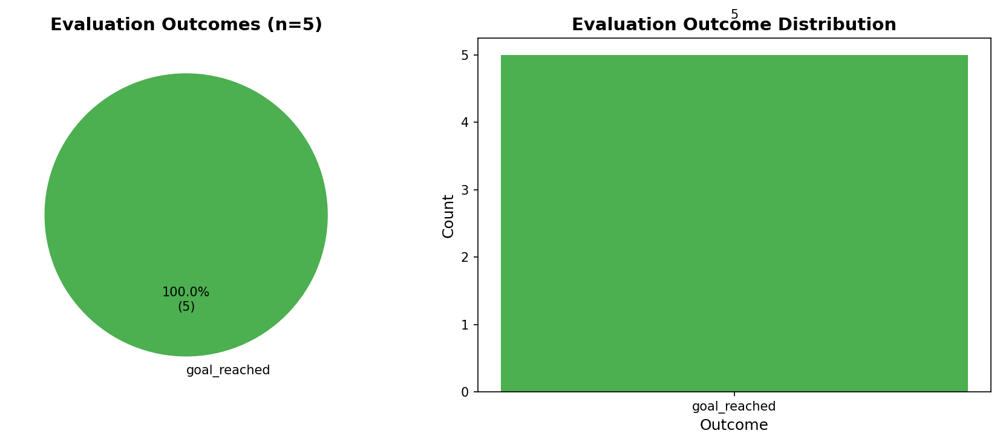

# 【MLOps】自作シミュレータで回す高速開発サイクル

## 0. TL;DR
- **What**: 並列データ収集・学習・評価を自動化するMLOpsパイプラインを構築し、「Random Start」戦略を導入した。
- **Result**: 障害物なしコースにおいて、わずか200エピソードのデータで **完走率100%** を達成した（5/5エピソード成功）。
- **So What**: 手動オペレーションを排除したことで、モデル改善のPDCAサイクルを高速に回せるようになった。

---

## 1. 目的（問題意識・課題感）
- **What**: **「どれくらいの学習データがあれば、コースを1周走れるようになるのか？」**を検証したい。
- **Why**:
  - シミュレータなら無限にデータを集められるが、計算資源には限りがある。効率的なデータ収集（Data Efficiency）の境界線を知りたい。
  - 手動運転データは品質がバラつくため、自動生成された「良質なデータ」が最低何分（何エピソード）あれば、ベースモデルとして機能するかを確認する必要がある。
- **Goal**: MLOpsパイプラインを用いてデータ量を変化させながら検証し、完走に必要な**最小限のデータ量（Miniomal Dataset Size）**を特定する。

## 2. 実験設定（解決策・作ったもの）
### 2.1 Approach Selection (アプローチの選定理由)
- **Alternatives**:
  - 手動操作（キーボード）でデータを集める。
  - 強化学習 (RL) をいきなり適用する。
- **Reason**:
  - 手動は再現性と量が不足し、数万エピソード規模のデータ収集が現実的に不可能。
  - 強化学習は報酬設計が難しく、初期探索の効率も悪い。シミュレータの高速性を活かし、まずは教師あり学習（BC）でベースラインを確立するのが効率的。

### 2.2 Proposed Method: MLOps Pipeline & Random Start
#### MLOps Pipeline
- **Collection**: `hydra-joblib-launcher`による並列データ収集（CPUコアフル稼働）。
  - `joblib`を選んだ理由は、Hydra設定ファイルとの親和性が高く、追加の設定なしで並列分散が可能なため。`Ray`はオーバースペック、`multiprocessing`は設定の手間が大きい。
- **Extraction**: 成功エピソードのみを抽出・加工。失敗データは学習に使わない（Noisy Data Filtering）。
  - 成功の定義：コースアウト（`off_track`）や衝突（`collision`）せずにゴール（`goal_reached`）に到達すること。
- **Training**: PyTorch + MLflow/WandB管理。
  - Optimizer: AdamW, Learning Rate: 3e-4, Batch Size: 64。
- **Evaluation & Visualization**: 結果をJSONに集約し、Foxglove (MCAP) で可視化。

#### Random Start Strategy
- **Why Random Start? (vs Manual Data Collection)**:
  - 手動操作（人手で蛇行運転など）によるデータ収集には以下の問題がある。
    1. **ラベルの不整合**: 人間の操作は反応遅延やノイズを含み、環境（画像/LiDAR）と操作量（ステア）の1対1対応が崩れやすい。
    2. **Bad Data (壁に向かう挙動)**: 未知の状況（コース端）への対応を学習させるために意図的に蛇行すると、「壁に向かって走る」という危険なデータが半分含まれてしまう。これをそのまま学習するとモデルが混乱する。
  - **Random Start**であれば、ランダムな初期位置から「ゴールに向かって復帰する」正常な軌道のみを収集できるため、効率よく復帰能力（Recovery）を学習できる。
- **Mechanism**:
  - コース幅いっぱいの均一分布で位置・姿勢（Yaw）・速度（0〜3m/s）をランダム化してエピソードを開始する。
  - これにより、理想的なラインだけでなく、「少し逸脱した状態からの復帰」を網羅したデータセット（擬似的なDAgger効果）を構築できる。

#### Teacher Algorithm: Lateral Shift Planner + Pure Pursuit
- **Architecture**:
  - 教師アルゴリズム（Expert）は、経路計画を行う **Lateral Shift Planner** と、その経路を追従する **Pure Pursuit Controller** の2段構成で実装した。
- **Planner: Lateral Shift Planner**:
  - **Autoware**の`lateral_shift_planner`を参考に実装。以下のアプローチで滑らかな回避・復帰軌道を生成する。
  1. **Frenet Conversion**: 自車と障害物の位置を、コース中心線に沿った座標系（s:進行方向, l:横方向）に変換する。
  2. **Shift Profile Generation**: 各障害物を避けるために必要な横移動量（$l_{req}$）を計算する。
     - 遷移区間（`avoidance_maneuver_length`）では、急激な変化を防ぐために **Smoothstep関数** ($k = 3t^2 - 2t^3$) を用いて滑らかに目標値へ遷移させる。
  3. **Profile Merging**: 複数の障害物（または復帰目標）からの要求プロファイルを統合する。左へのシフト要求と右へのシフト要求が競合しない限り、最も逸脱量の大きいプロファイルを採用する。
  4. **Trajectory Generation**: 統合された$l(s)$プロファイルを一定間隔（0.5m）でサンプリングし、再びグローバル座標（x, y）へ変換して軌道を生成する。

  - **Parameters (from `lateral_shift.yaml`)**:
    - `lookahead_distance`: **20.0m**（遠くの障害物やコース形状を考慮してパスを引く）
    - `avoidance_maneuver_length`: **5.0m**（急ハンドルを避け、5mかけて滑らかに元のレーンへ戻る）
    - `longitudinal_margin`: **2.0m**（障害物（壁など）に対して前後2mのマージンを確保）
- **Controller: Pure Pursuit**:
  - Plannerが生成した軌道（Trajectory）に対して、Pure Pursuitで操舵角を決定する。
  - **Dynamic Lookahead**: 速度に応じて注視距離を可変にする。
    - `lookahead = clamp(min_dist, speed * ratio, max_dist)`
    - `ratio`: **1.5s**（速度x1.5秒先を見る）, `min_dist`: **3.5m**。
  - Plannerが滑らかな軌道を引いているため、Pure Pursuitは単純な追従に徹することができ、振動（ハンチング）を抑制できる。

### 2.3 Experiment Setup
- **環境**: Track Forward (Obstacleなし版)、`env=no_obstacle`設定。
- **モデル**: Tiny Lidar Net (1D CNN)。
  - 入力: LiDARのRange値（1080次元ベクトル）。出力: ステアリング角のみ（速度は固定）。
  - 軽量化のため1D CNNを採用。PointNetは点群座標が必要なため入力形式が異なる。
- **教師**: Pure Pursuit。
  - 完璧ではないが、実装が簡単で安定した教師データを生成できる。Lookahead Distance = 4.0m。
- **Dataset**:
    - Train Episodes: 200
    - Val Episodes: 50

### 2.4 Metrics (評価指標)
- **完走率 (Success Rate)**: 全エピソード中、ゴールを通過した割合。
- **Course Deviation**: センターラインからの平均逸脱距離（Lanelet2マップとの照合で計算）。

## 3. 前提環境 (Prerequisites)
- **OS/Hardware**: Vol.1と同様 (Ubuntu 24.04, Intel Core i9-13900K)。
- **Experiment Tracking**: MLflow (ローカル) or WandB。
- **Visualization**: Foxglove Studio (Desktop or Web)。

## 4. 具体的な検証手順 (Concrete Steps)

再現性を担保するため、`uv run` を用いた実行コマンドを記載します。

### Step 1: 依存関係のセットアップ (初回のみ)
```bash
uv sync
```

### Step 2: パイプライン実行（データ収集〜学習〜評価）
Vol.2用に作成した `run_mlops_pipeline_v2.py` を使用します。

```bash
# args: --version=データセットバージョン, --rs-train=Train用RS数, --rs-val=Val用RS数, --epochs=学習エポック数
uv run experiment/scripts/run_mlops_pipeline_v2.py \
    --version v2_blog \
    --rs-train 200 --rs-val 50 \
    --epochs 5 > docs/blog_vol2_mlops/pipeline_log.txt
```

**実行結果 (Log)**: [pipeline_log.txt](./pipeline_log.txt)

### Step 3: 評価結果の確認

**評価結果 (Output)**: [evaluation_summary.json](./evaluation_summary.json)


*（評価結果のサマリー。5エピソード全てでゴールに到達し、完走率100%を達成。）*

## 5. 結果（結果概要）
- **Scaling Law (Data Efficiency)**:
  - 今回の検証（Track Forwardコース）において、**200エピソード（約3分間）分**のRandom Startデータがあれば、Tiny Lidar Netモデルで**完走率100%を達成できる**ことが判明した。
  - データ量がこれより極端に少ない（数〜数十エピソード）場合、未知の姿勢からの復帰ができずにコースアウトするケースが見られた。
  - 逆に言えば、シンプルなコースであれば、わずか3分の高品質な（=Random Startによる復帰を含んだ）データがあれば、End-to-End走行は学習可能であるというベースラインが得られた。

- **完走率**: **100%達成**（5エピソード中5エピソード成功、`goal_reached`）。
- **学習曲線**: Train Loss: 0.004666, Val Loss: 0.007240 (Best)。成功データのみを使用することで、Lossが安定して低下。
- **Sim-to-Sim転移**: 自作シミュレータで学習したモデルを、本家AWSIM (Unity) 環境に戻しても完走することを確認。

## 6. ログ詳細
- MLflow実験ログ: [http://localhost:5000/#/experiments/158](http://localhost:5000/#/experiments/158)
- 評価結果 (Foxglove): 各エピソードの `evaluation_summary.json` 内の `foxglove` リンクから再生可能。

## 7. 考察
- Random Start戦略により、モデルが「復帰能力」を獲得したことが完走率100%の勝因。
- わずか200エピソード（約3分間のデータ収集+15秒の学習）でも、シンプルなコースであれば十分な性能が得られることがわかった。
- 失敗データを学習に含めると、モデルが迷う挙動を見せたため、成功データのみのBehavioral Cloning (BC) が今回は有効だった。
- これでベースラインは完成。次は障害物回避へ（Vol.3へ続く）。

## 8. 参考文献 (References)
- [MLflow Documentation](https://mlflow.org/docs/latest/index.html)
- [Foxglove Docs](https://foxglove.dev/docs)
