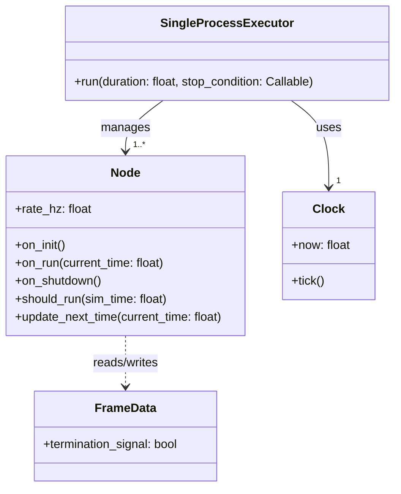

# Executor Specification

## Overview

The `Executor` component is responsible for orchestrating the simulation loop. It manages the execution of multiple `Node` instances based on a centralized `Clock`, ensuring that each node runs at its specified frequency.

Currently, the system provides a single implementation: `SingleProcessExecutor`.

## Architecture

The `SingleProcessExecutor` follows a synchronous, single-process execution model. It iterates through a main loop, advancing time and executing nodes sequentially within each step if their schedule permits.

### Component Relationships



## detailed Execution Flow

The `SingleProcessExecutor.run` method implements the following logic:

1.  **Initialization**:
    -   Calls `node.on_init()` for all registered nodes.
    -   Calculates the total number of steps based on `duration` and `clock.rate_hz` for the progress bar.

2.  **Main Loop**:
    -   Runs while `clock.now < duration`.
    -   **Stop Condition Check**:
        -   If a `stop_condition` callback is provided and returns `True`, the simulation terminates.
    -   **Termination Signal Check**:
        -   Iterates through all nodes checking if `node.frame_data.termination_signal` is `True`.
        -   If detected, logs the event and terminates the simulation.
    -   **Node Execution**:
        -   Iterates through each `node` in the list.
        -   Checks `node.should_run(clock.now)`.
        -   If `True`:
            -   Executes `result = node.on_run(clock.now)`.
            -   Updates the node's schedule via `node.update_next_time(clock.now)`.
            -   *Note: Return values `FAILED` or `SKIPPED` are currently logged/passed but do not halt the simulation.*
    -   **Time Advancement**:
        -   Calls `clock.tick()` to advance the simulation time.
    -   **Progress Update**:
        -   Updates the `tqdm` progress bar.

3.  **Shutdown**:
    -   In a `finally` block (ensuring execution even on error), calls `node.on_shutdown()` for all nodes.

## Scheduling Logic

The executor uses a polling-based scheduling mechanism:

-   **Period Calculation**: Each node calculates its period as `1.0 / rate_hz`.
-   **Next execution Time**: Maintained by each node in `self.next_time`.
-   **Check (`should_run`)**:
    ```python
    def should_run(self, sim_time: float) -> bool:
        # Returns True if current time is greater than or equal to scheduled next time
        # Includes a small epsilon (1e-9) for floating point stability
        return sim_time + 1e-9 >= self.next_time
    ```
-   **Update (`update_next_time`)**:
    ```python
    def update_next_time(self, current_time: float) -> None:
        # Schedules next run relative to CURRENT time (not theoretical scheduled time)
        # This prevents drift catch-up but may introduce slight phase shifts
        self.next_time = current_time + self.period
    ```

## Data Exchange

Data is exchanged between nodes via a shared `FrameData` object (or specific fields within it).
-   Nodes write to `FrameData` during `on_run`.
-   The Executor checks `FrameData` specifically for the `termination_signal`.

## Interfaces

### Node Interface
Must implement:
-   `on_init()`: Setup resources.
-   `on_run(current_time)`: Main logic. Returns `NodeExecutionResult`.
-   `on_shutdown()`: Cleanup resources.
-   `should_run(sim_time)`: detailed above.
-   `update_next_time(current_time)`: detailed above.

### Clock Interface
Must implement:
-   `now`: Property returning current time in seconds.
-   `tick()`: Advances time by one step.

## File Locations

-   **Implementation**: `core/src/core/executor/single_process.py`
-   **Interfaces**:
    -   `core/src/core/interfaces/node.py`
    -   `core/src/core/interfaces/clock.py`
