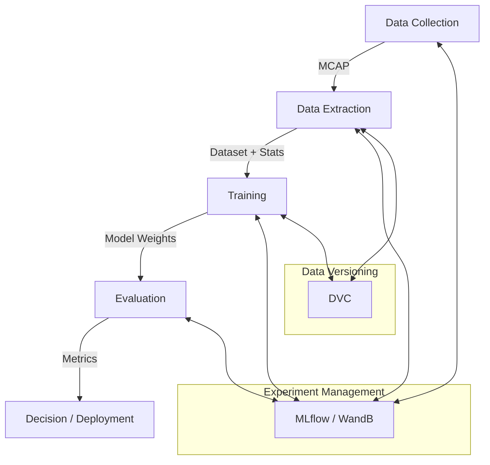

# Tiny Lidar Net MLOps Flow

このドキュメントでは、Tiny Lidar Net（LiDARベースの回避モデル）を用いた自動運転AIの開発において、理想的なデータ収集、学習、評価のフローを記述します。

---

## 🏗️ 全体アーキテクチャ

実験管理に **MLflow / WandB**、データ管理に **DVC**、設定管理に **Hydra** を活用した、再現性の高いMLパイプラインを目指します。



---

## 1. データ収集 (Data Collection)

多様なシナリオでの走行データを効率的に、かつ再現性を持って収集します。

### 並列データ収集 (推奨)
Hydraの **Joblib Launcher** を使用して複数のエピソードを並列実行し、高速にデータを収集します。
各ジョブで `seed` を変え、`num_episodes=1` とすることで重複なく大量のエピソードを生成できます。

- **実行例**:
  ```bash
  # data_collection_parallel設定を使用して並列実行
  # 並列数などは data_collection_parallel.yaml で設定済み（Joblib使用、GUI無効化など）
  uv run experiment-runner -m \
    experiment=data_collection_parallel \
    env.obstacles.generation.seed="range(100,105)" \
    split=train
  ```
  **効果**: Joblib Launcherを使用することで、直列実行と比較して **約4.4倍** の高速化を確認しています（50エピソード実行時: 382秒 -> 87秒）。
  > [!NOTE]
  > `collector` は内部ループで `seed` をインクリメントしながら `num_episodes` 分のエピソードを生成します（例: seed=100 -> 100, 101, 102...）。
  > そのため、Multirunでシードをスイープする場合は、設定した `num_episodes` 以上の間隔を空けてください。単純に `100, 101, 102` とするとシードが重複し、同じシナリオが繰り返し生成されてしまいます。
  >
  > [!IMPORTANT]
  > 大量試行時は必ず `postprocess.foxglove.auto_open=false` を設定してください。そうしないと、エピソードごとにFoxgloveが開き、システムがフリーズする可能性があります。


### エピソード管理
各エピソードは独立したディレクトリに保存され、以下を含みます：
- `simulation.mcap`: 全センサー・制御ログ
- `config.yaml`: そのエピソードで使用された完全な設定（障害物配置を含む）
- `result.json`: シミュレーションの結果（成功/失敗、衝突理由、通過メトリクス）


---

## 2. データセットの分析

シミュレーションで収集したデータ（`metrics`, `success` rate 等）は、各エピソードの `result.json` に保存されます。以下のスクリプトを実行することで、これらの結果を集計できます。

```bash
# 直近の実行結果を自動で検出して集計（推奨）
uv run python summarize_results.py

# 特定のディレクトリを指定して集計
uv run python summarize_results.py outputs/2025-XX-XX/HH-MM-SS
```

このスクリプトは指定されたディレクトリ以下のすべての `result.json` を探索し、以下の情報を出力します：
- 総エピソード数
- 成功率
- 失敗理由の分布（衝突など）
- メトリクスの平均値

また、集計結果は `aggregated_results.csv` として保存されます。

---

## 3. データ抽出・選別 (Extraction & Filtering)

生ログ（MCAP）から、学習に適した「クリーンな」データセットを構築します。

### 回避成功データのみを抽出 (Behavioral Cloning)
**重要**: AIに「正しい回避行動」を学習させるため、シミュレーションで衝突（Failed）したデータは学習セットから除外します。

- **フィルタリング・ロジック**: `result.json` を参照し、`success: true` のエピソードのみを処理対象とします。
- **同期**: LiDARスキャン時刻と制御入力（ステアリング、アクセル）をタイムスタンプベースで同期し、学習ペアを作成します。
- **正規化用統計**: 抽出時にデータセット全体の平均・標準偏差を計算し `stats.json` として保存します。

---

## 4. 学習 (Training)

実験の過程を完全に追跡可能にします。

### 実験管理 (Tracking)
- **MLflow**: 各学習ランのパラメータ、メトリクス、モデルアーティファクトを記録。
- **WandB**: 学習曲線、勾配の可視化、システムのメトリクス（GPU使用率等）をリアルタイム監視。

### データの履歴管理 (Lineage)
- DVC を使用して、どのバージョンのデータセットを使用して学習したかをモデルと紐付けます。
- `stats.json` を使用して学習時にデータをオンライン正規化します。

---

## 5. 評価 (Evaluation)

モデルの汎化性能を定量的・定性的に検証します。

### 再現性のあるベンチマーク
- 評価専用のシード値セットを使用し、未学習のシナリオで評価します。
- **成功率 (Success Rate)**、**衝突までの平均距離 (MPC)**、**チェックポイント通過率** などをメトリクスとして算出します。

### デバッグと可視化
- 評価時の全走行をMCAPとして記録。
- **Foxglove** や **Dashboard** を使用して、AIがどこで・なぜ失敗したかを視覚的に分析します。

---

## 💡 今後の改善ロードマップ

1.  **失敗データの活用 (Hard Negative Mining)**: 衝突エピソード周辺েরデータを「やってはいけない行動」として強化学習や対照学習に利用する。
2.  **データオーギュメンテーション**: LiDARスキャンへのノイズ付加や、オフセットを加えた擬似的な位置からのスキャン生成。
3.  **自動化パイプライン**: `experiment-runner` を CI/CD ツールと連携させ、コードの変更ごとに自動でベンチマーク評価を実行。
