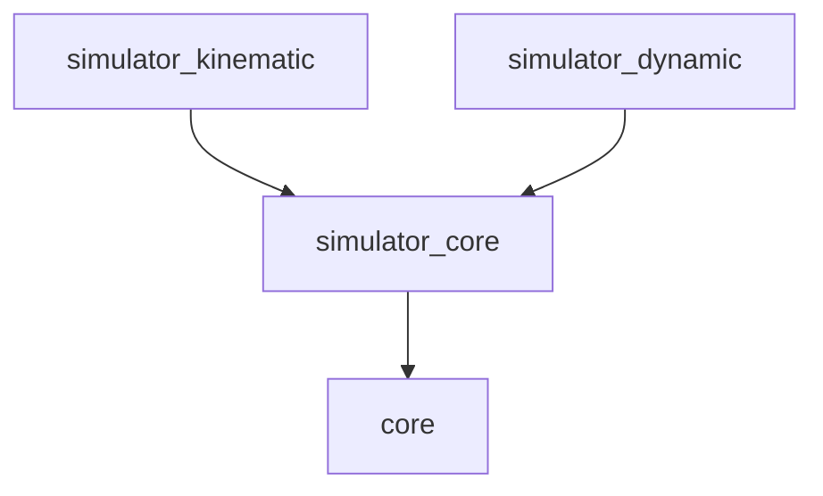

# Simulators

シミュレーション環境を提供するパッケージ群です。

## パッケージ構成

- **[simulator_core](./simulator_core/README.md)**: 全てのシミュレータの基底クラスと共通ユーティリティ（車両パラメータ、環境定義など）。
- **[simulator_kinematic](./simulator_kinematic/README.md)**: 自転車モデルに基づく運動学シミュレータ。
- **[simulator_dynamic](./simulator_dynamic/README.md)**: 車両動力学を考慮した動的シミュレータ。

## 依存関係

